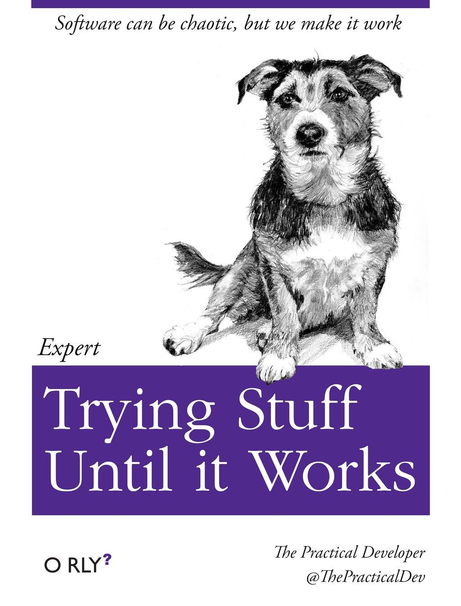

<!-- #this comment will not be knitted
The style of the document is provided by the custum css file : styles.css
-->

```{r setup, include=FALSE}
knitr::opts_chunk$set(echo = FALSE)

```


## This is a slide with some text over two paragraphs

"Lorem ipsum dolor sit amet, consectetur adipiscing elit, sed do eiusmod tempor incididunt ut labore et dolore magna aliqua. 

Ut enim ad minim veniam, quis nostrud exercitation ullamco laboris nisi ut aliquip ex ea commodo consequat. Duis aute irure dolor in reprehenderit in voluptate velit esse cillum dolore eu fugiat nulla pariatur. Excepteur sint occaecat cupidatat non proident, sunt in culpa qui officia deserunt mollit anim id est laborum."

## heading 2 again with custum classes

<div class="red2">
This text is red
</div>

<div class="centered">
This text is centered.
</div>

## A slide with a blockqoute

> Give a man to a fish and he'll don't know what to do


# A heading 1 (one pount symbol (#))

will create a new slide. with a weird view.

## A heading 2

will create a slide with the heading at the top.

<div class="footer">This block of text will appear with the 'footer' style</div>

## example image





This is an example of an image floating right.

I have set the size in percentage (of the whole image).

I'm still looking for a way to adjust the images for the screen size.

## Looks like normal 
class:titlepage

find more sheet examples at

<https://github.com/jasonm23/markdown-css-themes>

follow procedure on <http://www.stat.ubc.ca/~jenny/STAT545A/topic10_tablesCSS.html>

look for inspiration on

<https://github.com/rstudio/tufte/blob/master/inst/rmarkdown/templates/tufte_html/resources/tufte.css>